# SOAR Framework Solution Pack

# Overview 

SOAR Framework **Solution Pack** (SFwSP) lays the foundation to use the FortiSOAR platform optimally for Incident response and automation use cases in a Security Operations Center (SOC).  

## How does this Solution Pack work for you?

SFwSP installs several modules such as alerts, incidents, and indicators along with corresponding playbooks, dashboards, reports, and widgets to make it a comprehensive solution and provide a fully functional Incident Response Platform augmented by Automation and Threat Intelligence. 

## Advantages of SOAR Framework Solution Pack 

Some key benefits of SOAR Framework SP: 

* Provides standardized modules for various operations in a SOC – e.g. alerts, incidents, indicators, campaigns, and hunts
* Helps establish and follow a standardized process through playbooks for indicator extraction, enrichment, and mitigation
* Standardized dashboards and reports around several key performance indicators of SOC helps better monitor the setup
* Helps build various other solution packs on top of SFwSP thereby extending the system in a standardized way for various use cases, through an included framework

## Overall Design 

Let us begin with understanding the overall design/process of receiving the alerts (from various sources such as SIEM) and responding to them efficiently using automated playbooks. During the process, we will also learn about several pre-built modules, playbooks, integrations, and dashboards/reports to manage the overall SOC efficiently.  

## Terminology 

* **Alert**: An actionable event received from SIEM, EDR, or other threat detection platforms for cyber security analysts to respond to them. Along similar lines, you could also ingest emails, typically sent to SOC common inbox for investigation, and FortiSOAR receives them as alerts.  
* **Triage:** Triaging is the process of receiving raw alerts from a data source and conducting any required Indicator enrichment and investigation, to determine if the alert requires an escalation to investigate for further review, or simply closed as a false positive. 
* **Data Source**: A data aggregator, search,and reporting systems that gather immense amounts of data from your entire networked environment and makes that data human accessible. 

## Information Flow

The FortiSOAR process happens in multiple steps starting from ingestion of alerts, extraction and enrichment of indicators, multiple playbooks execution to assign various degrees of urgency to alerts received,culminating in the alert’s investigation to conclude if the given alert is a false positive or a true positive. 

In case of a true positive, the SOC escalates related alertsinto an incident, leveraging crisis management using war rooms and severalother utilities, to respond to the incident. 

The following diagram helps better understand the overall process and the subsequent explanations.

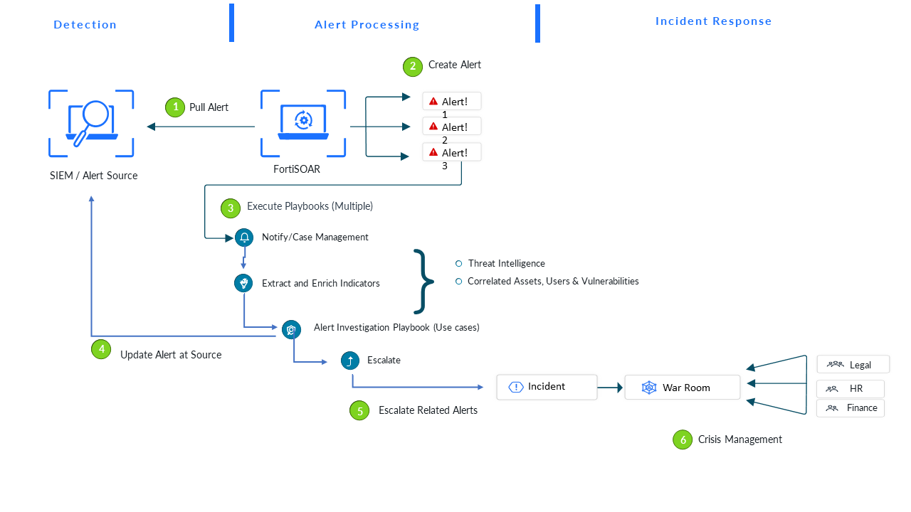

**Pull alerts from the data source** - FortiSOAR, at regular intervals, pulls alerts from configured alert sources such as SIEM, EDR, or email. This process is the Data Ingestion and it creates the alert records in the system. 

After the creation of an alert, launching multiple playbooks, in a specific order, achieve the intended objectives:

1. **Extract indicators **– For each newlycreated alert, FortiSOAR executes a playbook named “**Extract Indicators**”.This playbook creates **Indicator** records for the known fields ofinterest. Refer to Extending Default Alert Schema section for additionaldetails. 
2. **Enrich Indicators** – After creating anindicator record, FortiSOAR triggers a playbook such as “**Indicator (TypeDomain) – Get Reputation**” to gather desired context (aka Enrichment) and tocompute the reputation of the given indicator. Enrichment happens from varioussources, e.g. SIEM or EDR correlation, indicator enrichment from availableopen-source intelligence, and users’ details enrichment from Active Directory®. For additionaldetails, refer to Extending Default Indicator Enrichment Process section. 
3. **Triage** - Triaging is identification ofthe criticality of data and asset, severity of the incident, decide containmentstrategies, follow escalation matrix, and then act on the defined isolation andblocking strategies. Suppose there are multiple alerts signifying an incident –a threat actor is attempting to gain access to two computers (assets) in yournetwork; one of the assets is an endpoint with sensitive data and other is adecoy. In this case while triaging, you assign higher priority on the endpointwith sensitive data. 
4. **Action** - After a successful triage,playbooks help take corrective action on the triaged indicators. Actions mayinclude asset mitigation by isolation, blocking domains and URLs throughfirewalls, and blocking or disabling users and IP addresses. 
5. **Hunt** - Hunt playbooks search and identifysuspicious domains, malware, files, or other indicators and create alerts asand when such threats are located. 
6. **Case Management** - Case Managementplaybooks automate processes like adding users as case owners, tracking SLA andresolution timelines, among other things. It also contains playbooks thatresolve an alert by taking appropriate action or marking it as an 'incident'and escalating it. 
7. **Incident Response** - These playbooks help plan response to an incident like a malware attack.

After the completion of Indicator extraction and enrichment,the alert is ready for further investigation. This state is internally identified as “state=ready to investigate”. Here, some playbooks trigger to respond to a specific type of alert. These are **Use Case Playbooks**. The playbook collection named “**02 – Use Cases**” contains multiple playbooks. A collection of playbooks has names that carry the prefix “02 – Use Cases; e.g., **02- Use Case - Brute Force Attack**.

At the end of this cycle, the given alert is either marked as **False Positive **and **closed** **or marked as **True Positive and Escalated into an Incident**. Note, the Escalation into an incident by default is a manual step (by clicking Escalate button), but the same can also be automated via invoking **Escalate to Incident Playbook** into the respective response playbooks. 

Marking an alert as closed invokes a corresponding close source alert playbook. This playbook, by default, simply prompts you to close the alert at the source; however, you can (or should) modify that to use the respective products connectors (such as FortiSIEM) to invoke the closure action. This way you can update the source systems to your desired state.

## Additional Resources 

* [Configuring Data Ingestion Process](#configuring-data-Ingestion-process)
* [Extending Default Alert Schema](#extending-default-alert-schema)
* [Extending Default Indicator Extraction Process](#extending-default-indicator-extraction-process)
* [Extending Default Indicator Enrichment Process](#extending-default-indicator-enrichment-process)

## Prerequisites

SOAR Framework Solution Pack is the base solution pack there are no prerequisites to install it.

## Contents

This section lists the various contents of the SOAR Framework Solution Pack.

### Connector List

SOAR framework includes the following connectors:

| **Sr. No.** | **Connector Names**        |
| ----------- | -------------------------- |
| 1           | Active Directory           |
| 2           | AlienVault-OTX             |
| 3           | CarbonBlack Response       |
| 4           | ElasticSearch              |
| 5           | Exchange                   |
| 6           | Fortinet FortiClient EMS   |
| 7           | Fortinet FortiEDR          |
| 8           | Fortinet FortiGate         |
| 9           | Fortinet FortiSandbox      |
| 10          | Fortinet FortiSIEM         |
| 11          | Fortinet Web Filter Lookup |
| 12          | IBM XForce                 |
| 13          | IPStack                    |
| 14          | MxToolbox                  |
| 15          | NMAP Scanner               |
| 16          | SLA Calculator             |
| 17          | ThreatQ                    |
| 18          | URLScan.io                 |
| 19          | URLVoid                    |
| 20          | VirusTotal                 |
| 21          | Whois RDAP                 |

### Modules

The SOAR framework includes the following modules:

| **Sr. No.** | **Modules**   |
| ----------- | ------------- |
| 1           | Alerts        |
| 2           | Announcements |
| 3           | Assets        |
| 4           | Campaigns     |
| 5           | Communication |
| 6           | Events        |
| 7           | Hunt          |
| 8           | Incidents     |
| 9           | Indicators    |
| 10          | SLA Template  |
| 11          | War Rooms     |

#### Alerts

Alerts are primary actionable data elements that we obtain through a periodic ingestion process. We extract data through multiple channels like emails, SIEM platforms, or EDR platforms to create alerts. Once we have alerts, multiple playbooks are launched to extract and enrich the indicators.

##### Default Alert Schema

| **Field Title**                  | **Field API Key  Name** | **Type**       |
| -------------------------------- | ----------------------- | -------------- |
| Ack Date                         | `ackDate`               | `Datetime`     |
| Ack Due Date                     | `dueBy`                 | `Datetime`     |
| Ack SLA                          | `ackSlaStatus`          | `Picklist`     |
| Ack SLA Paused  Date             | `ackSLApausedon`        | `Datetime`     |
| Alerts                           | `alerts`                | `Many To Many` |
| Assets                           | `assets`                | `Many To Many` |
| Assigned Date                    | `assigneddate`          | `Datetime`     |
| Assigned To                      | `assignedTo`            | `Lookup`       |
| Attachment  Names                | `attachmentNames`       | `Text`         |
| Attachments                      | `attachments`           | `Many To Many` |
| Bucket Name                      | `bucketName`            | `Text`         |
| Bytes  Transferred               | `bytesTransferred`      | `Text`         |
| Campaigns                        | `campaigns`             | `Many To Many` |
| Closure Notes                    | `closureNotes`          | `Richtext`     |
| Closure Reason                   | `closureReason`         | `Picklist`     |
| Command Line                     | `commandLine`           | `Text`         |
| Comments                         | `comments`              | `Many To Many` |
| Communications                   | `communications`        | `Many To Many` |
| Companies                        | `companies`             | `Many To Many` |
| Computer Name                    | `computerName`          | `Text`         |
| Decoded  Command Line            | `decodedCommandLine`    | `Text`         |
| Description                      | `description`           | `Richtext`     |
| Destination ID                   | `destinationID`         | `Text`         |
| Destination IP                   | `destinationIp`         | `Text`         |
| Destination  Port                | `destinationPort`       | `Text`         |
| Detection Date                   | `alertDetectionDate`    | `Datetime`     |
| Device Owner                     | `deviceOwner`           | `Text`         |
| Device Serial  No                | `deviceSerialNo`        | `Text`         |
| Device Type                      | `deviceType`            | `Picklist`     |
| Device UID                       | `deviceUID`             | `Text`         |
| Domain                           | `domain`                | `Text`         |
| Email                            | `fileEmail`             | `File`         |
| Email Body                       | `emailBody`             | `Richtext`     |
| Email  Classification            | `emailClassification`   | `Picklist`     |
| Email From                       | `emailFrom`             | `Email`        |
| Email Headers                    | `emailHeaders`          | `Textarea`     |
| Email  Recipients (To)           | `emailTo`               | `Text`         |
| Email Subject                    | `emailSubject`          | `Text`         |
| Epoch Time                       | `epochTime`             | `Text`         |
| Escalated                        | `escalatedtoincident`   | `Picklist`     |
| Escalation  Reason               | `escalationReason`      | `Richtext`     |
| Event Time                       | `eventTime`             | `Text`         |
| Events                           | `events`                | `One To Many`  |
| File Hash                        | `fileHash`              | `Text`         |
| File Name                        | `fileName`              | `Text`         |
| File Names                       | `fileNames`             | `Textarea`     |
| File Path                        | `filePath`              | `Text`         |
| Hunts                            | `hunts`                 | `Many To Many` |
| Incidents                        | `incidents`             | `Many To Many` |
| Indicators                       | `indicators`            | `Many To Many` |
| Kill Chain  Phase                | `killChainPhase`        | `Picklist`     |
| Latest Login                     | `latestLogin`           | `Text`         |
| Metrics                          | `metrics`               | `Richtext`     |
| MITRE  ATT&CK ID                 | `mitreattackid`         | `Text`         |
| MITRE  Technique                 | `mitreTechnique`        | `Text`         |
| Name                             | `name`                  | `Text`         |
| Parent Process  Command Line     | `parentProcessCmdLine`  | `Text`         |
| Parent Process  ID               | `parentProcessPid`      | `Text`         |
| Parent Process  Name             | `parentProcessName`     | `Text`         |
| People                           | `persons`               | `Many To Many` |
| Priority  Weight                 | `priorityWeight`        | `Integer`      |
| Process GUID                     | `processGuid`           | `Text`         |
| Process ID                       | `processId`             | `Text`         |
| Process Name                     | `processName`           | `Text`         |
| Process Tree                     | `processTree`           | `Text`         |
| Recipient Email  Address         | `recipientEmailAddress` | `Textarea`     |
| Registry Key                     | `registryKey`           | `Text`         |
| Registry Key  Value              | `registryKeyValue`      | `Text`         |
| Remaining Ack  SLA on Pause      | `alertRemainingAckSLA`  | `Integer`      |
| Remaining  Response SLA on Pause | `alertRemainingRespSLA` | `Integer`      |
| Reporter                         | `reporter`              | `Text`         |
| Reporter Email  Body             | `reporterEmailBody`     | `Richtext`     |
| Resolved Date                    | `resolveddate`          | `Datetime`     |
| Response Date                    | `respDate`              | `Datetime`     |
| Response Due  Date               | `respDueDate`           | `Datetime`     |
| Response SLA                     | `respSlaStatus`         | `Picklist`     |
| Response SLA  Paused Date        | `respSLApausedon`       | `Datetime`     |
| Return Path                      | `returnPath`            | `Text`         |
| Scheduled Task                   | `scheduledTask`         | `Text`         |
| Sender Domain                    | `senderDomain`          | `Text`         |
| Sender Email  Address            | `senderEmailAddress`    | `Text`         |
| Service                          | `services`              | `Text`         |
| Severity                         | `severity`              | `Picklist`     |
| Source                           | `source`                | `Text`         |
| Source Data                      | `sourcedata`            | `Textarea`     |
| Source ID                        | `sourceId`              | `Text`         |
| Source IP                        | `sourceIp`              | `Text`         |
| Source Port                      | `sourcePort`            | `Text`         |
| Source Process                   | `sourceProcess`         | `Text`         |
| Source Tool                      | `sourceTool`            | `Text`         |
| Source Type                      | `sourceType`            | `Text`         |
| State                            | `state`                 | `picklist`     |
| Status                           | `status`                | `Picklist`     |
| Target Asset                     | `targetAsset`           | `Text`         |
| Target Process                   | `targetProcess`         | `Text`         |
| Task                             | `tasks`                 | `Many To Many` |
| Type                             | `type`                  | `Picklist`     |
| URL                              | `url`                   | `Text`         |
| User Details                     | `userDetails`           | `Text`         |
| Username                         | `userName`              | `Text`         |
| UUID                             | `uuid`                  |                |
| Vulnerability  Severity          | `vulnerabilitySeverity` | `Integer`      |
| War Rooms                        | `warrooms`              | `Many To Many` |

##### Extending Default Alert Schema

You can add more fields to the existing alert schema. To add fields, open the module editor by clicking **Settings** and in the **Application Editor** section, click **Modules**. This displays the **Modules** page.

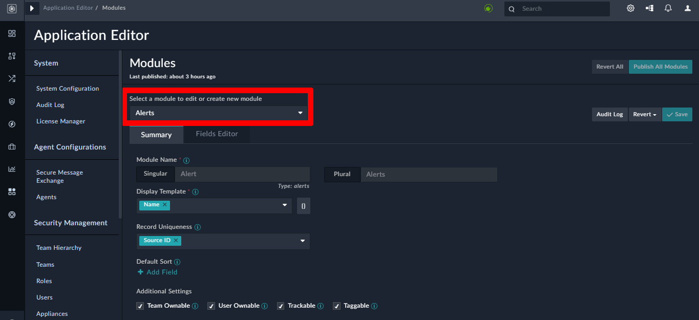

From the drop-down, select **Alerts** (Highlighted). Open the **Fields Editor** tab beside **Summary**.

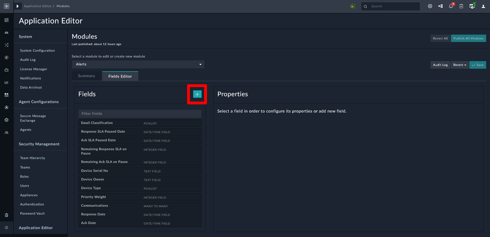

To add fields, on the **Modules** page, click the **Fields Editor** tab and click the Add (**+**) icon beside **Fields**. Following **Properties** interface appears.

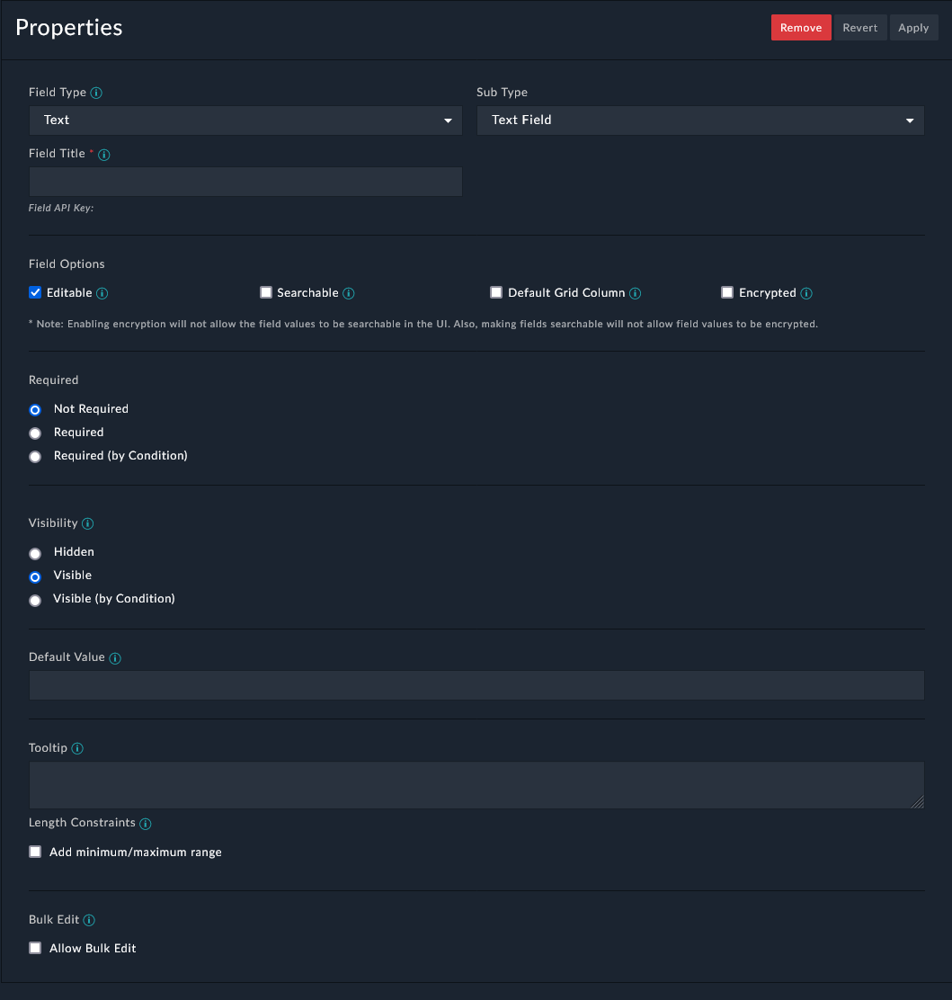

> **Note**: The Fields Editor pane displays the list of fields defined for that module. You can filter the fields by typing the search term in the Filter Fields `textbox`.

Define the following properties for the newly added field:

* **Field Type**: The type of field; it specifies the type of form used to render this attribute. Examples of fieldtypes are text, file field, checkbox, integer, decimal, date/time, picklist,and relationship fields.

We recommend that when you create a fieldof type Integer, then you should set its default value as "zero".

Use the JSON field type for fields such as,*Source Data*, which commonly store data in the JSON format to allowplaybooks to get to the JSON data directly, without having to use a JSON parsestep. You can also define the height of the JSON field in pixels by editingyour record template.

Based on the **Field Type** that youselect, you can see an additional field. For example, if you select the fieldtype as *Picklist*, a Picklist drop-down list will appear, and you mustselect the picklist associated with the field or click **Create new picklist**to add a new picklist. Use the **Configure Picklist Option Visibility**checkbox to filter a picklist field based on specified criteria. Once you checkthis checkbox, the picklist items are displayed and you can choose whether theitem should be *Visible*, *Disabled*, *Hidden*, *ConditionallyVisible*, or *Conditionally Enabled*. If you choose *ConditionallyVisible* or *Conditionally Enabled*, you can then define the criterionwhen this item should be visible.

FortiSOAR also supports a special type of picklist, called "**Multiselect Picklist**". You can use the multi-select picklist for fields that can contain more than one value. For example, you can have an alert be assigned more than one "Type", i.e., an alert can be of type Brute Force Alert and Malware. In such a case,you can assign Multi-select Picklist as the Field Type for the "Type"field. You can then select an existing picklist from the picklist drop-down list, for example `AlertType`, or click Create new picklist to create a new picklist. You can also click Modify picklist to modify the existing picklist, by adding or removing picklist items or changing the properties of the picklist items.

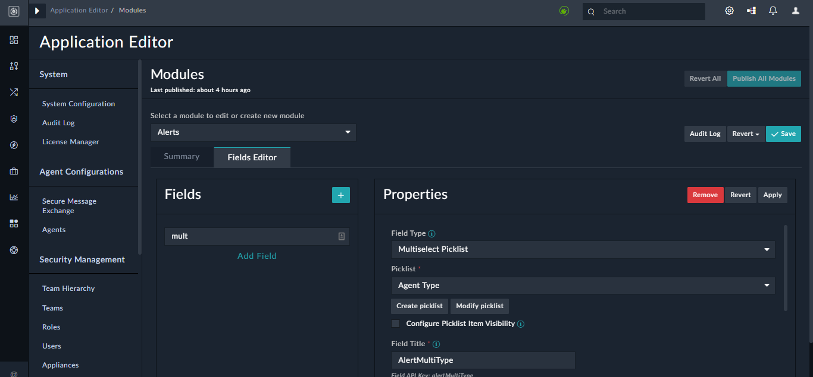

If you select Lookup (One to Many or One to One), Many to One, or Many to Many, a Related Model drop-down list will appear. You must select the related module, and provide the Field Title before you publish the module. In case of the **Many to Many** relation field types, fields are by default added with same module name to the other side of related module.

In the case of Lookup (One to Many or One to One), fields that have **People** as a related module contain the **Filter Setting** section. If you select the **Only show users with record ownership** checkbox in the **Filter Settings** section, then the list of users displayed in the lookup on the UI is restricted to include only those users who have record ownership. Further, you can also limit the list of users displayed in the lookup based on permissions given to the user on the module using the Limit ownership users to ones with module access to option. In the **Limit ownership users to ones with module access to** option, you can choose to display users who have Read access or Update (Read + Update) access.

> **Example**: In the Alerts module, we have an **Assigned To** field, which is of type **Lookup (One to Many or One to One)**, with **People** as the related module. In this case, by default, all users appear in the **Assigned To lookup**, when you open an alert record. However, this could include users who belong to other teams, and who, therefore, would not have access to the record, even if you assign that record to that user.

Therefore, to restrict the users to only those users who have access to the record, you can select the **Only show users with record ownership** checkbox. You can further restrict users displayed in the **Assigned To** lookup based on the module access. For example, if you want to display only those users who can update the record, in the **Limit ownership users to ones with module access to** field, select the **Update** checkbox (once you select the Update checkbox, the Read checkbox is automatically checked).

You can drag and drop files in the "File Field" type field. An example of a "File Field" is "Email"; therefore, if you have an Email field in your record, then you can drag and drop an email to attach it to the record as shown in the following image:

* **Sub-Type**: You can use the "Sub-Type" field along with the **Text** field type. When you select **Text** in the **Field Type**, then an additional field named **Sub-Type** appears. You can select the sub-type such as, Text Field, Rich Text (Markdown), Rich Text (HTML), Text Area, IPv4, IPv6, Domain, URL, or Filehash. The sub-type field enforces the format of data that the user can enter in that field. For example, in a Rich Text (HTML) or Rich Text (Markdown) fields, you can use formatting options or you can use the IP address and domain field types to lookup threat intelligence tools and whois info. You can also add images in the richtext fields (or in the Richtext Content widget); however, in case of .svg files, the Chrome browser does not restrict expansion of XML entities inside SVGs, which can rendering of image tag with any link in the href attribute that could case a client-side denial of service. Therefore, administrators can choose not to load SVG files enabled in HTML or Markdown Editors by updating the `/opt/cyops-ui/vendor/config.json` file using `SSH`. In the `config.json` file, update the value of the `AllowSVGContent` parameter to 'false'. In such a case the SVG will render as `<\\img src="https:\/\/link.svg">` in a richtext field, such as the 'Description' or the 'Comment' field.

> **Note**: For all modules, the default rich text editor is set to "Markdown", i.e., the Rich Text (Markdown) is selected for rich text fields. You can change the editor from markdown to HTML by selecting the appropriate sub-type for a field and then publish the module for the changes to reflect.

* **Field Title**: A short descriptive name describing the item.

The Field API Key is automatically created based on the value of Field Title field. The field can be alphanumeric, starts with a lower-case alphabet, and does not contain any spaces, underscores or any special characters. Note that the value of this field does not change after the field creation and publishing of the module. This is because there is no migration path from the old name to the new name, so you risk data loss if this value is changed. Therefore, even if you change the Field Title value the value of the Field API Key remains unchanged.

> **Note**: If you have a field, in a module, whose **Field Title (Singular Description)** attribute value contains a `.` or `$`, then the Audit Logs replace the `.` or `$` with an `_`. For example, if you have a field `SourceID` whose singular description you have specified as `Source.ID`, then in this field it appears as `Source_ID` in Audit Logs.

* **Editable**: Selecting this option allows you to modify the field after the creation of a module record. If this option remains unselected, then you cannot modify the initial value after creating the record.
* **Delete Associations With Parent**: Selecting this option cascades the deletion of a parent record to all the associated records for the Many to One relation type fields. For example, Events and Alerts have a Many to One relationship, i.e., one alert could have many associated events. If you select this option, then if an alert is deleted all its associated events also get deleted. Another example would be the case where one alert has multiple comments, and selecting this option cascade deletes the comments that are associated with a deleted alert.

>  **Warning**: Select this option with caution since RBAC is Not applied for child records. For example, if you have Delete permissions on the Alerts module but not on the Events module, and you have selected this option, then deleting an alert with associated events, leads to the associated events getting deleted, irrespective of the permissions on the Events modules.

* **Searchable**: Selecting this option makes this field searchable in the grid view.
* **Default Grid Column**: Selecting this option makes the field appear as a column by default in the grid view. The order of the grid columns is defined by order of the fields in the Field Editor list. For information about grids, see the Dashboards, Templates, and Widgets section in the "User Guide."
* **Enable for recommendation**: Selecting this option enables this field to accept values generated from the recommendation engine. Once you select this option, then an 'Auto populate' checkbox will appear beside this field while configuring data ingestion and also while creating or updating records using playbooks. This option appears for fields of type 'Picklist' and 'Lookup'.
* **Encrypted**: Selecting this option enables encrypting of field values before storing in the database for enhanced security. FortiSOAR UI will continue to display the non-encrypted values. Currently, Text Fields, Email Fields, Rich Text Area and Text Area fields can be encrypted. FortiSOAR uses AES-256 encryption to encrypt and store the values in the database.

>  **Important**: Once you enable encryption you cannot search the field values in FortiSOAR UI. Filters also will not work on encrypted fields. You also cannot use the upsert functionality for fields that are encrypted.

* **Required**: Specifies whether the field is a required field. The options are

  * Not required
  * Required
  * Required (by condition).

  Once you select **Required (by condition)**, FortiSOAR displays the Condition Builder options where you must add the necessary condition.

>  **Note**: FortiSOAR also supports advanced date operations and nested conditions for the Required (by condition) fields i.e., the Add Condition Group link is now available for these fields.

>  **Important**: Do not choose the Visibility = Hidden option for Required (by condition) fields.

* Visibility: Specifies whether the field is visible or not. The options are:
  * **Hidden**: If you select the Hidden option, then the field is only accessible at the API level and not shown in the UI.
  * **Visible**: If you select the Visible option, then the field is displayed on the UI.
  * **Visible (by condition)**: If you select the Visible (by condition) option, then the field is displayed on the UI only if the specific conditions are met.
    Once you select Visible (by condition), FortiSOAR displays the Condition Builder options where you must add the necessary condition.

> **Note**: FortiSOAR also supports advanced date operations nested conditions for the Visible (by condition) fields i.e., the Add Condition Group link is now available for these fields:
>
> 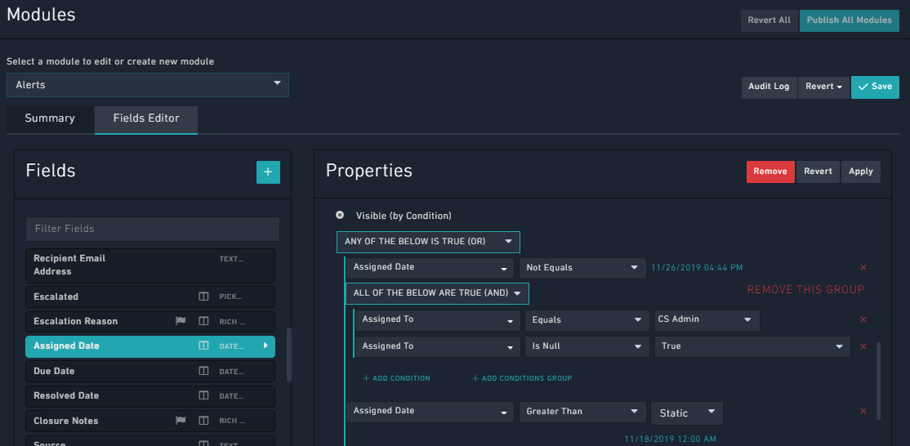
>
> * **Default Value**: Specifies the default value of this field. Once you specify a value in this field, then this value appears, by default, when you add a record in the selected module.
>
>   For example, if you want the status of a newly created alert to be set to Open, by default, then select the Status field and from the Default Value drop-down list, select **Open** as shown in the following image:
>
>   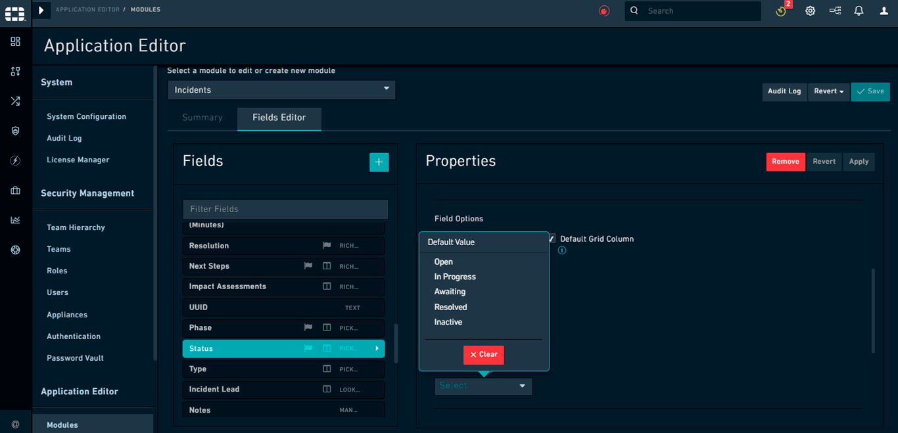
>
>   In the **Default Value** field for the `Date/Time` field type you can specify either a Static date/time or a Custom date/time. If you select **Static**, click the **Select Date** icon to display the Calendar and select the required date/time. If you select **Custom**, then you can specify a date/time relative to the current date/time such as 1 hour from now, or 3 hours ago.
>
>   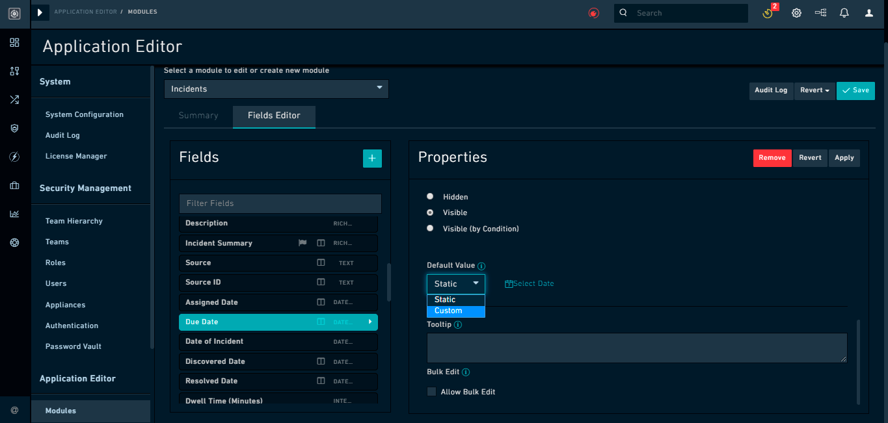
>
> * **Tooltip**: Brief definitions that you can optionally add to fields. This definition is displayed when you click the information (i) icon of the field that has tooltip information added while creating, updating, or viewing records.
>
> * **Length Constraints**: In case of a Text field with sub-type set as Text Field or Text Area, you can specify length constraints by clicking the Add minimum/maximum range checkbox, if you want to override the default field length constraints by providing a minimum-maximum range for a field. Once you select the Add minimum/maximum range checkbox, you can specify the minimum character length for the field in the Minimum field and the maximum character length for the field in the Maximum field. You can enter any number from 0 to the maximum character length that is applicable for that field in the database. FortiSOAR will display a validation message if the maximum character length for the field is exceeded, or if the minimum character length for the field is not met.
>
> * **Bulk Edit**: Selecting the Allow Bulk Edit option to allow bulk edit operations on the selected field.
>
>   For example, if you have selected the Severity field, in the Alerts module, and have clicked Allow Bulk Edit, this means the users can select multiple records in the grid view of the Alerts module and change the severity of those records to a particular severity level.
>
>   For example, if you have selected the Severity field, in the Alerts module, and have clicked Allow Bulk Edit, this means the users can select multiple records in the grid view of the Alerts module and change the severity of those records to a particular severity level.

You must enter the following details for the button that you want to use for the bulk edit operation:

* **Button Text**: In the Button Text field, type the name of the label that should appear on the bulk action button. For example, type Change Type.

* **Button Icon**: From the Button Icon drop-down list, select the icon that should appear on the bulk action button. If you do not want an icon, select None.

* **Button Classes**: From the Button Classes drop-down list, select from the Default, Primary, Danger, or Warning styles.

  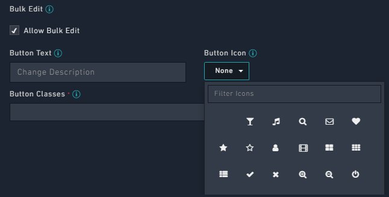

Once you save the changes and publish the module, a **Change Severity** button appears in the **Alerts module** in the action bar. For more information on how to use the bulk action button, see the [Workingwith Modules - Alerts & Incidents chapter in the FortiSOAR User Guide](https://docs.fortinet.com/document/fortisoar/7.0.2/user-guide/207087/working-with-modules-alerts-incidents#Working_with_Alerts_and_Incidents). You can add the Bulk Edit Action button for any other fields, such as **Status**, **Assigned To**, and **Type**.

You can also define the order of the default grid columns, defined by the order of the fields in the **Fields Editor** list. Fields appear in the **Fields** column and you can drag-and-drop the fields to sequence them. You can also filter fields using the **Filter Fields** box.

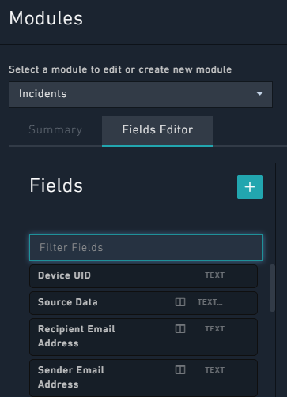

###### Saving your changes

Whenever you make any changes to a module or a field, you must stage those changes by saving. At the top-right of the **Module Editor** is the **Save** button, which applies any changes made to the staged data. To update the database and make your changes to go live, you must **Publish** the updated modules.

The **Revert** button clears any changes made in the interface since the last **Save** event. If you go into a module and realize that you have edited the wrong field, use **Revert** to clear the changes. However, once you press **Save**, you have to undo the changes manually.

###### Viewing your changes

Editing any of the fields of a module does not mean those fields are accessible immediately within the UI or the API. The fields must be first represented in the database. The templates included might automatically discover these fields, or these fields might need to be added manually to the template to specify their location within the interface. However, you can set the grid defaults within the attribute data for the model itself.

To update the database and make your changes to go live, you must **Publish** the updated modules.

###### Publishing modules

Whenever you change a field or a module and click Save, the change is staged but is not yet live in the system. You must perform a Publish to ensure that the changes are made in the system.
You initiate a publish action by clicking the Publish All Modules button at the top-right of the Module Editor page. Publishing pushes the changes that you have made to fields and modules to the database. Up until the Publish point, all changes to the data model in the Module Editor are saved as metadata, which is information that describes the structure of other information.
A Publish is the point at which the changes are truly irreversible, meaning that an unintended field deletion could cause irretrievable data loss. Use Publish carefully and verify changes before Publishing to avoid any problems.

##### Data Ingestion

Running an alert through the system to find signs and understand if there was a threat is Data Ingestion or Alert Ingestion.

FortiSOAR has a dedicated data ingestion process that facilitates data ingestion from external SIEM solutions and other third-party sources like threat intelligence platforms, email solutions, etc. It also takes care of scheduling of data ingestion into FortiSOAR, if you have enabled the connector for scheduling.

FortiSOAR assists in fetching sample data from the source, mapping fields from the source data into a FortiSOAR module and sets up an ingestion schedule. The system dynamically generates the ingestion workflows without the user being exposed to the details of playbooks and easing the process of configuring ingestion.
Data ingestion has the following features:

* Supports fetching data for each configuration of your connector, i.e., if you have two configurations present in your connector, then you can pull ingestion data for each configuration.
* Supports multiple queries for pulling data based on your requirement; however, you must specify one query to schedule pulling of data from the connector into FortiSOAR.
* Supports easy and efficient ingestion of data from various sources using the intuitive UI of the Data ingestion wizard.
* Supports monitoring of the data ingestion that you have set up and provides information on which connectors are configured for using the Data Ingestion Wizard on the Data Ingestion tab of the Connectors page. The Data Ingestion also provides you other information such as what is the status of a configuration, what is the schedule for ingestion, when data was last pulled using that configuration, etc.

Supports inserting or ‘upserting’ records in bulk during data ingestion, which improves the performance since all the records are created or ‘upserted’ in one request.

###### Configuring Data Ingestion Process

The **Data Ingestion** tab displays connectors that are configured for using the Data Ingestion Wizard, i.e., you can use the data ingestion wizard to ingest data into FortiSOAR for these connectors.

To view the data ingestion tab, log on to FortiSOAR and on the left navigation pane, click **Automation** > **Connectors**. Click the **Data Ingestion** tab, which will display all the connectors that are enabled for data ingestion, along with the number of configurations available for that connector.

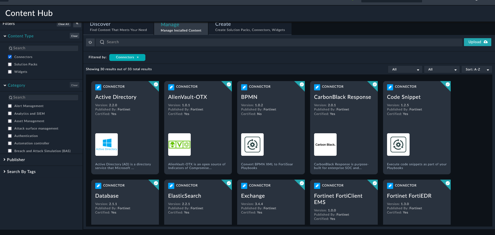

You can filter the display on the Data Ingestion page to show all the connectors that are enabled for data ingestion, whether configured or not, by clicking the **All** (default) filter. To view connectors that are enabled for data ingestion, but not configured, click the **Not Configured** filter, and to view connectors that are enabled for data ingestion that are configured, click the **Configured** filter. You can search for a connector by its name in the **Search by connector name** field. In case of connectors that are not configured, you can click the **Add Configuration** link to open the **Connector Configuration** page of that connector enabling you to configure the connector.

1.  Log on to FortiSOAR.

2.  On the left navigation pane, click **Automation** > **Connectors** > **Installed**.
   On **Installed Connectors** page, you will see the list of installed connectors, either in grid/list view or in the card view.
    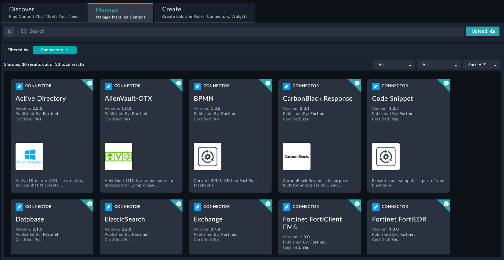

3.  Click a connector using which you want to ingest data. For our example, we have chosen *Anomali ThreatStream*.

4.  On the **Connector Configuration** pane, from the **Select Configuration** drop-down list select the configuration for which you want to configure the ingestion, and then click **Configure Data Ingestion**.
   

 Only connectors that have been enabled for data ingestion will have the **Configure Data Ingestion** button. To ingest data, your connector must be in the **Available** state.

5.  Click **Configure Data Ingestion** to display the Start screen of the **Data Ingestion Wizard**.

 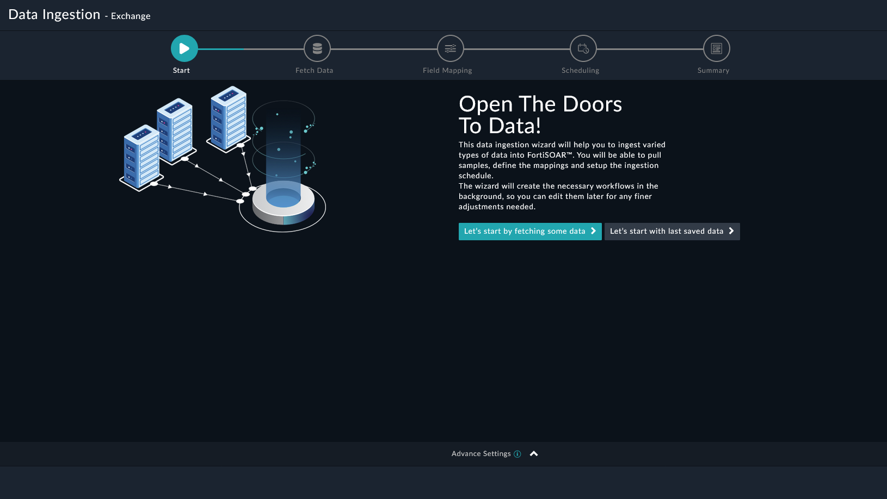

6.  Click the **Let's start by fetching some data** button to display the **Fetch Sample Data** screen.

7.  Sample data is required to create a field mapping between your connector data and FortiSOAR. The sample data is pulled from connector actions or ingestion playbooks. By default, FortiSOAR ingests data using an "Ingestion Playbook" that is included by default with each connector that is enabled for data ingestion.
   A connector would generally require some configuration details, which you will require to fill in on this screen. For example, in the case of Anomali ThreatStream, in the **Search Query** field, enter the query based on which you want to fetch data into FortiSOAR. In the **Number of Incidents to Fetch** field, enter the number of incidents that will be fetched from Anomali ThreatStream, for example 10. In the **Fetch Incidents in Last X Min**, enter the number of minutes for which indicators that will be fetched from Anomali ThreatStream, for example 10, in this case the data ingestion wizard will fetch indicators created in the last 10 minutes in Anomali ThreatStream, and then click **Fetch Data**.

 

8.  On the Field Mapping screen, map the fields of the sample data to the fields present in FortiSOAR as follows:

   1.  The Field Mapping screen displays the Sample Data on the right side of the screen and the Field Mapping (FortiSOAR fields) on the left side of the screen. The sample data is in the form of a Key-Value pair.

      From the Module drop-down list that appears next to Field Mapping, select the FortiSOAR module for which you want to map the fields. The default module will be already be selected, for example, Indicators.

      > **Note**: If you select any module other than the default module, you have to remap all the fields.

      2.From the Sample Data fields, map the fields onto the fields present in the Indicators module as follows:

      > **Important**: Some fields such as Name and some picklists can come pre-mapped with their keys. You do not require to re-map these fields unless you want to override their default values. You can search for fields in the record and in the sample data.

      To map a field, click the key in the sample data to add [Jinja](https://jinja.palletsprojects.com/en/3.1.x/) for the field. For example, description from the Anomali ThreatStream sample data can be mapped to **Description** field in FortiSOAR by clicking **Description**. Once you click **Description** in Sample Data, its key will be added to the **Description** field.

      

      To view the key of a field, double click in the field; for example, if you click the newly-mapped description field, its key `{{vars.sourcedata["description"]}}` appears. Once the key (which is in Jinja) becomes visible, this field appears with the key value.

      > **Note**: If bulk insert or ‘upsert’ is supported for the connector, for example, IMAP, then the key value changes from `{{vars.sourcedata["name of the field"]}}` to `{{vars.item["name of the field"]}}`. For example, `{{vars.item["description"]}}`.

      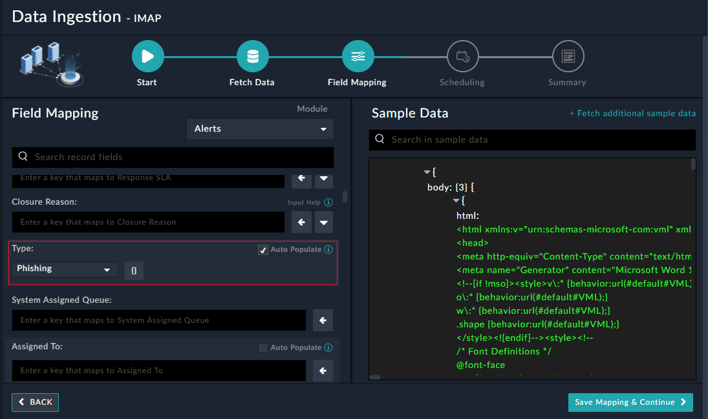

      If you select the **Auto populate** checkbox, and users have not specified any values for such fields, then the value of such fields get auto-populated with the values from the recommendation engine that is based on learning from past similar records.

      Picklists can come pre-populated with their defineddefaults, if they are available. You can also map picklists using the wizard.

      To map a picklist, such as **Reputation**, select the picklist whose value you want to map. For example, **confidence** from the Anomali ThreatStream sample data can be mapped to the **Reputation** picklist in FortiSOAR by clicking **confidence**. FortiSOAR would already have mapped this picklist by default, and it will appear as confidence whose key value is `{{vars.sourcedata["confidence"]}}`. Next, you must map the items of the Reputation picklists. To view and map the items of the Reputation picklist in FortiSOAR, click the down arrow (v). The Reputation picklist has items such as **Good**, **Malicious**, **Suspicious**, **TBD**,and **No Reputation Available**. These picklist items can be mapped as per the values defined in the source. You can map more than one picklist item in FortiSOAR can map to a single value in the source. For example, you can map both **TBD** and **No Reputation Available** to 0 in FortiSOAR. You can also map one picklist item in FortiSOAR to two values or more values in the source, for example, Suspicious can be 1, 2, 3, 4, 5. In this case, if the **confidence** field in Anomali ThreatStream has value 1, 2, 3, 4, or 5, then all cases with confidence 1 to 5 will be mapped to **Suspicious** reputation in FortiSOAR.You can also specify mapping of a range of values, lesser than, and greater than values. For example, **Good** can be mapped `91..100` in FortiSOAR, which means that if the confidence field in Anomali ThreatStream contains any value between 91 to 100 they will be mapped to **Good** in FortiSOAR.Similarly, if you map **Malicious** to `>5<91` in FortiSOAR this means that if the confidence field in Anomali ThreatStream contains any value greater than 5 and less than 91, then they will be mapped to Malicious reputation in FortiSOAR.

      > **Note**: Multiple expressions of type "number" must be separated by a space. Also, in case of a range there must be two dots between the numbers.

      You can also specify string values in a picklist such as Open, In Progress, Closed, etc. Multiple expressions of type `string` must be comma-separated.

      In case you want to use another query to fetch additional data in order to create comprehensive mapping, click the **+ Fetch additional sample data** link that appears in the Sample Data header. Clicking the **+Fetch additional sample data** link opens the **Configurations** dialog in which you can change the configuration such as, updating the `Search_query` and click **Fetch Data**. The data ingestion wizard fetches the data based on the updated configuration in a new page in the **Sample Data section**.You can continue mapping based on the newly fetched data.

      Once you are satisfied with the mappings, click **Save Mapping & Continue**.

   9.If your connector is enabled for scheduling, such as that of Anomali ThreatStream, then you will be shown the **Scheduling** screen. You can use this screen to specify the schedule for data ingestion from the connector into FortiSOAR, i.e., you can specify the polling frequency to a third-party integration, such as SIEM, so that the content gets pulled from the third-party integration into FortiSOAR. By default, scheduling is set to pull data every 5 minutes.

   To configure scheduling, from the **Do you want to schedule the ingestion?** drop-down list, select **Yes**.

   In the **Configure Schedule Settings** section, specify the [Cron expression](https://docs.oracle.com/cd/E12058_01/doc/doc.1014/e12030/cron_expressions.htm) for the schedule. For example, if you want to pull data from Anomali ThreatStream every 15 minutes, click **Every X Minute**, and in the minute box enter `*/15`.
   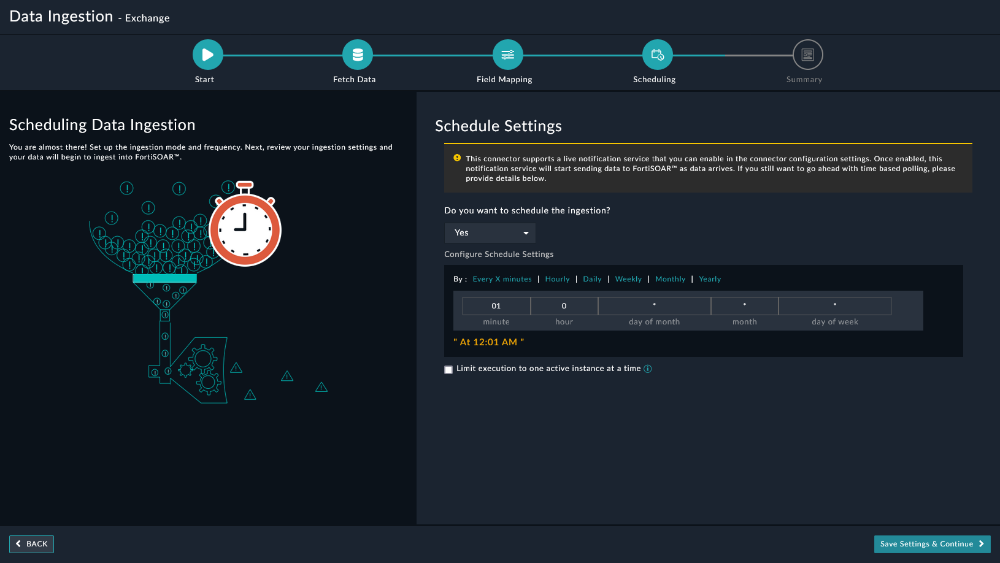

   **Note**: If you select the **Limit execution to one active instance at a time** checkbox, then do not rerun the workflow (schedule) if the previous schedule is still running. Some connectors such as IMAP support data
   ingestion using both a scheduled-based pull as well as instant notification using the Notification Service. However, you must configure only one of the two, since both would otherwise pull the data from the same source and there could be data loss due to conflicts. Therefore, the **Scheduling** screen for the IMAP connector displays the following warning:

   

   Only if you want to ingest data using a scheduled-based pull, then you should use the **Scheduling** screen to specify the schedule for data ingestion from the IMAP connector into FortiSOAR.

   Once you are satisfied with the scheduling, click **Save Settings & Continue**.

   10.The Summary screen displays a summary of the mapping done, and it contains links to the Ingestion playbooks.

   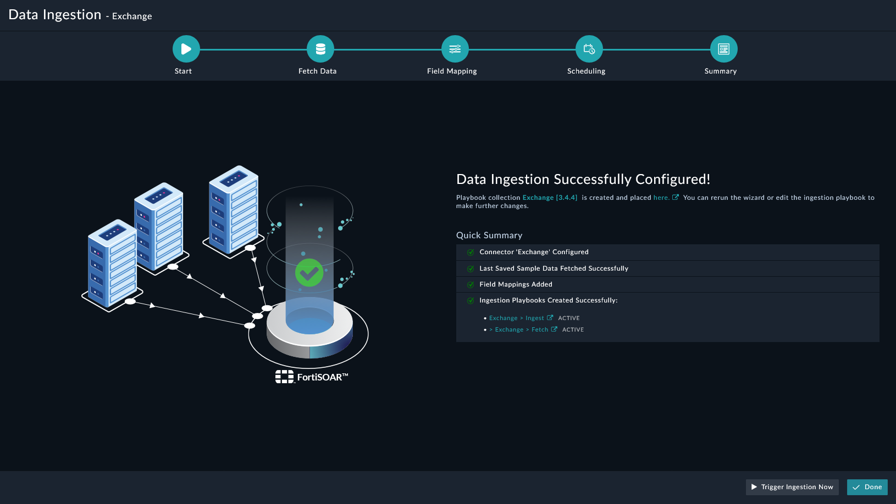

   11.Click **Done** to complete the data ingestion and exit the **Data Ingestion Wizard**.

##### Indicator Extraction

Indicator extraction identifies indicators from different sources in the system, extracts them and creates indicators. After extraction, the next step is indicator enrichment.

In FortiSOAR, the indicator extraction feature extracts indicators from incident fields and enriches them using playbooks defined for the indicator type. In the indicator extraction, you can configure the extraction logic according to the incident type and according to the associated field.

We recommend that you optimize the indicator extraction process define extraction settings for each incident type as needed.

E.g., for a malware, you extract all IP addresses, but for a phishing attempt, you only want to extract IP addresses from specific email headers. For attachments, you may want to disable indicator extraction to reduce external API usage and protect restricted data.

###### Extending Default Indicator Extraction Process

FortiSOAR has automated the indicator extraction process through sets of playbooks; however, you can enhance the indicator extraction process by adding more fields of interest to a playbook so that it picks more fields apart from the ones specified in the playbook.

E.g., the default playbook may not collect a field of interest, say “targeted employee email address”. This field of interest must be a part of the alert that we intend to target. To add a field to the alert, refer to the section [Extending Default Alert Schema](#extending-default-alert-schema).

You can extend the indicator extraction by modifying existing playbooks or creating a new one.

Navigate to Automation > Playbooks. You can select fromexisting playbooks or [create a new playbook](https://docs.fortinet.com/document/fortisoar/7.0.2/playbooks-guide/331279/introduction-to-playbooks#Creating_Playbooks).

For this example, let us consider one of the existingplaybooks. From the playbook collections on the left, select **03 – Enrich(22)**. This playbook is included with the SOAR Framework Solution pack.

> Refer to playbooks section in this document to check the [playbook collection](#playbook-collection) included with this Solution Pack.

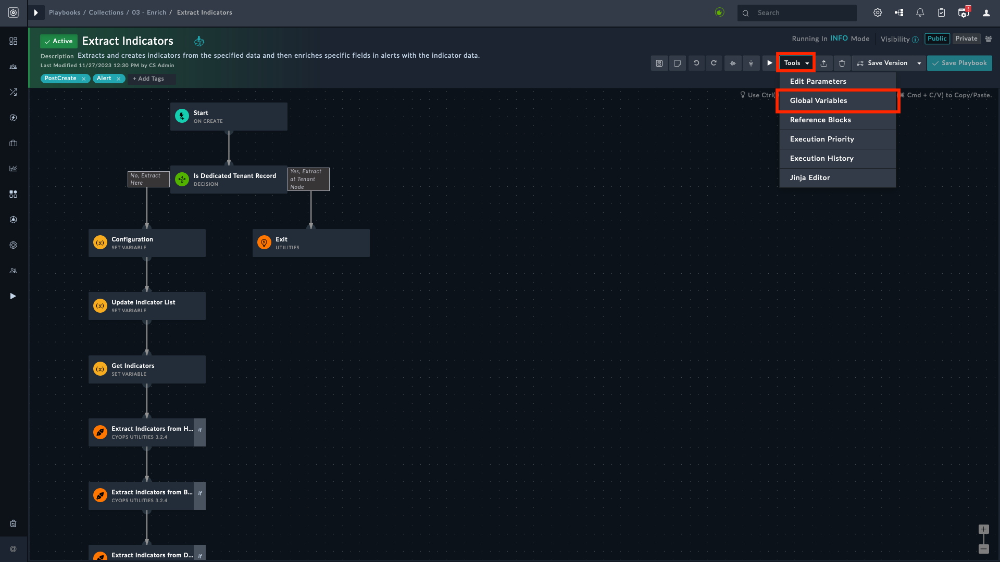

Under **03 – Enrich (22)** select the playbook **Extract Indicators**. Select **Tools** > **Global Variables**.

From the Global variables on the left, click the edit button on **Indicator_Type_Map**.

When you add a new field to the alert schema, you specify a **Field Type** and – based on your fieldname – get a **Field API Key** name.

Enter the Field API Key and the Field Type in JSON’skey-value pair format in the box labelled **Field Value\***. Click **Submit**to save the changes and **Save Playbook** to publish them.

Now your playbook captures indicators corresponding to thefield of interest specified.

##### Indicator Enrichment

For every indicator, file URL, hash, domain, IP address, user; there is a corresponding enrichment playbook that goes through multiple intelligence platforms, and other processes, collects the data, and puts that information in a formatted manner to the indicator record.

In the default Indicator Enrichment process,

* The playbooks trigger on indicator creation
* The playbook then takes the Type and Value fromthe indicators
* It reaches out to various sources to set the reputation in the indicator record

Taking the data from these sources it formats and populates the description field with enrichment data

###### Extending Default Indicator Enrichment Process

While these playbooks provide a strong foundation for enriching indicators in FortiSOAR, multiple configurations and subsequent playbook actions become available even after deployment. Going beyond investigation, you can add additional playbooks to run the indicators through various sources and services to get reputation and other context about indicators.

Consider a playbook **Indicator (Type Domain) - GetReputation** under the playbook collection 03 – Enrich (22). This playbooktriggers on creation of an indicator. It then takes the data and runs itthrough sources like Anomali ThreatStream and AlienVault to get reputation. Thenext step in this playbook formats the data received and fills the decription.

To add a step parallel to **Get Reputation…**refer to [playbooks steps in the playbooks guide](https://docs.fortinet.com/document/fortisoar/7.0.2/playbooks-guide/784146/triggers-steps#Playbook_Steps_..5).

#### Announcements

Announcements module helps notify users who are a part of a [war room](#war-rooms). 

#### Assets

Assets represent a unique piece of hardware and any information known about that hardware, such as MAC address, hostname, or IP address. Assets preferably have a unique identifier. The assets module helps add devices within FortiSOAR for use by the SOC team. Computers typically represent the assets of your organization. 

#### Campaigns

Campaigns are a collection of incidents relatable to a single threat actor. Many times, disparate incidents are connected attempts of a malicious attacker attempting to probe and gain access to a network.

#### Communication

It helps users to communicate with external entities like tenant contacts, and other SOC teams, using email, instant messaging (IM), etc. from within an alert generated in FortiSOAR. For this purpose, it uses IMAP and Exchange connectors.

#### Events

Events consist of records that contain machine-level information about activity that triggered a specific alert.

#### Hunt

The Hunts module is a place to store and organize your hunts. The hunt you create here will be the central repository where all Alerts, Assets, Users, and other modules’ records that become associated with your hunting activity will be linked together. 

#### Incidents

Incidents are confirmed alerts that negatively affect the confidentiality, integrity, and availability of an organization. Incidents represent a collection of information discovered during an Incident Response investigation. Incidents are triggered based on the suspicion or confirmation of a security breach.

#### Indicators

**Indicators of compromise** (IOCs) serve as evidence of probable intrusions on a host system or network. These artifacts help personnel at a Security Operations Center (SOC) to detect intrusion attempts or other malicious activities. IOCs help better analyze a particular malware’s techniques and behaviors and provide actionable threat intelligence to further improve an organization’s incident response strategies.

Some of this evidence of potential breach is found on event logs and timestamped entries in the system, applications, and services.

#### SLA Template

SLA Templates in FortiSOAR help create an in-built SLA management for incidents and alerts. For more information, please refer to [SLA Management](https://docs.fortinet.com/document/fortisoar/7.0.2/administration-guide/792686/sla-management). 

#### War Rooms

War Rooms in FortiSOAR is a collaborative space that enables SOC teams to mitigate a critical cyber threat scenario or campaign. FortiSOAR makes it easy for analysts to quickly and easily provision a War Room that allows participation of all stakeholders to analyze and collaborate to quickly mitigate the threat and restore the services. For more information, see the War Rooms chapter.

### Playbooks

SOAR Framework includes the following playbooks:

- 01 – Drafts (0)
- 02 - Use Cases (0)
- 03 – Enrich (22)
- 03 - Enrich (Pluggable) (36)
- 03 – Triage (9)
- 04 – Actions (36)
- 05 – Hunt (1)
- 06 - IRP - Case Management (54)
- 06 - IRP - Communications Tracking (8)
- 06 - IRP – Reporting (2)
- 06 - IRP - War Room (12)
- 07 - Incident Response Plan (3)
- 08 – Utilities (9)

#### Naming Convention

Playbooks follow a specific order of execution and are arranged in the same sequence as the flow of alert ingestion in SOAR Framework. Hence the name carries a number that defines the order in which the playbooks run.

### Rules

Rules provide a framework to define a condition that generates notifications.

The SOAR Framework includes the following rules:

- Alert > Notify Creation - It sends a notification, via the app or the email, whenever an alert is **created**.
- Alert > Notify Update - It sends a notification, via the app or the email, whenever an alert is **updated**.
- Incident > Notify Creation - It sends a notification, via the app or the email, whenever an incident is **created**.
- Incident > Notify Update - It sends a notification, via the app or the email, whenever an incident is **updated**.

### Widgets

Widgets render information for the visual display inside View Template. Widget types vary such that specific widgets only correspond to certain view types. For example, the detail view has some exclusive widgets, such as Visual Correlation, Comments, Timeline, etc.

SOAR Framework has the following widgets:

| **Widgets**                | Description                              |
| -------------------------- | ---------------------------------------- |
| Task Management (War Room) | It is a comprehensive task management widget that helps users manage tasks and get visibility into the current task board. |
| Record Summary (War Room)  | It is primarily designed to showcase a particular record's highlights or summary, this widget houses multiple utility widgets within it to allow for customized uses. |
| SLA Count Down Timer       | This widget displays the remaining time for an SLA. |
| User Tile                  | This widget shows relevant information like alerts, incidents, and tasks to users. |
| Incident Correlations      | This widget displays the correlation graph of an incident. |

### Roles

SOAR framework has the following roles included:

- SOC Analyst
- SOC Manager

### Dashboards

A Dashboard is the default landing page, and users' home page, that users see when they log into FortiSOAR. Dashboard, at a glance, shows them the critical tasks on which they need to work. SOAR Framework includes the following dashboards:

| **Sr. No.** | **Dashboards** |
| ----------- | -------------- |
| 1           | Overview       |
| 2           | ROI Summary    |
| 3           | SOC Admin      |
| 4           | Analyst        |

### Reports

The reports module displays various reports for specific, defined users. SOAR framework includes the following reports:

| **Sr. No.** | **Reports**                  |
| ----------- | ---------------------------- |
| 1           | High Impact Incidents        |
| 2           | Incident Summary Report      |
| 3           | Overdue Alert Activities     |
| 4           | Overdue Incidents Activities |
| 5           | Unhandled Activities         |
| 6           | War Room Summary Reports     |
| 7           | War Room Summary             |
| 8           | Weekly Alert Report          |
| 9           | Weekly IOC Report            |
| 10          | Weekly Incident Report       |

## Playbook Collection

The playbook collection is designed so that it runs in a specific order. Each collection has multiple playbooks with each containing tasks undertaken on each run.

### Enrich Playbook Collection

It has two playbook collections

- 03 - Enrich
- 03 - Enrich (Pluggable)

#### 03 - Enrich

Playbooks in the *03-Enrich* collection help perform enrichment of data -- one of the first incident response tasks. Automating data enrichment tasks helps better manage increasing volumes of threats and provide more actionable context to the analysts. An example of an enrichment type playbook would be retrieving the reputation of a file, domain, URL, etc. from threat intelligence platforms such as Anomali ThreatStream and VirusTotal.

Following is a table that lists the playbooks that are part of the *“03-Enrich”*collection in the Solution Pack:

| Sr. No | Name of the playbook                     | Description                              |
| ------ | ---------------------------------------- | ---------------------------------------- |
| 1      | Asset - Get Running Process              | Retrieves a list of all processesthat are running on the specified host. |
| 2      | Attachment - Get File Reputation         | Retrieves the reputation of afile that is submitted from FortiSOAR to VirusTotal. |
| 3      | Create Indicators (Batch)                | Creates indicator records inbulk.        |
| 4      | Extract Indicators                       | Extracts and creates indicatorsfrom the specified data and then enriches specific fields in alerts with theindicator data. |
| 5      | Extract Indicators - Manual              | Extracts and creates indicatorsfrom the specified alert records and then enriches specific fields in alertswith the indicator data. |
| 6      | Fotinet Fortisandbox (GetReputation) - Get Scan Results | Retrieves the job verdict detailsfor submitted samples based on the specified job ID. |
| 7      | Get Related IOCs For An IP               | Retrieves related IOCs for aspecified IP address from threat intel sources. |
| 8      | Get Reputation After SpecifiedTime       | Re-enriches indicators after a specifiedtime. |
| 9      | Indicator (Manual Trigger)-Get Latest Reputation | Retrieves the reputation ofindicators using configured threat intelligence tools. You can trigger thisplaybook by manually selecting the indicator(s). |
| 10     | Indicator (Type All) - Get LatestReputation | Based on the type of indicator,this playbook retrieves the reputation of indicators using configured threatintelligence tools. |
| 11     | Indicator (Type Domain) - GetReputation  | Retrieves the reputation of indicatorsof type ‘Domain’ using configured threat intelligence tools. |
| 12     | Indicator (Type Email) - GetReputation   | Retrieves the reputation of indicatorsof type ‘Email Address’ using configured threat intelligence tools. |
| 13     | Indicator (Type File) - GetReputation    | Uploads a file to a sandbox andthen retrieves its reputation using configured threat intelligence tools. |
| 14     | Indicator (Type File) - GetReputation (Fortinet Sandbox) | Submits a file to FortinetSandbox and then retrieves its reputation. |
| 15     | Indicator (Type File - MD5) - GetReputation | Retrieves the reputation of afile, identified by its MD5 hash, using configured threat intelligence tools. |
| 16     | Indicator (Type Host) - GetReputation    | Retrieves the reputation of indicatorsof type ‘Host’ using configured threat intelligence tools. |
| 17     | Indicator (Type IP) - GetReputation      | Retrieves the reputation of indicatorsof type ‘IP Address’ using configured threat intelligence tools. |
| 18     | Indicator (Type Port) - GetReputation    | Retrieves the reputation of indicatorsof type ‘Port’ using configured threat intelligence tools. |
| 19     | Indicator (Type Process) - GetReputation | Retrieves the reputation of indicatorsof type ‘Process’ using configured threat intelligence tools. |
| 20     | Indicator (Type URL) - GetReputation     | Retrieves the reputation of indicatorsof type ‘URL’ using configured threat intelligence tools. |
| 21     | Indicator (Type URL) - GetReputation (Fortinet Sandbox) | Submit URL to FortinetFortiSandbox.      |
| 22     | Indicator (Type User Account) -Get Details | Retrieves the details of indicators of type ‘User Account’ using configured threat intelligence tools. |

#### 03 - Enrich (Pluggable)

The function of the playbooks in both *Enrich* and *Enrich (Pluggable)* collection is the same; however, the design approach is different. In the standard *Enrich* playbook, all threat intelligence platforms for a particular indicator type are configured in a single playbook. In *Enrich (Pluggable)* collection, every threat intelligence platform for a particular indicator type has a separate playbook, which can be plugged in or referenced to the enrichment playbook.

| Sr. No. | Name of the playbook                     | Description                              |
| ------- | ---------------------------------------- | ---------------------------------------- |
| 1       | AlienValut OTX - File MD5Reputation      | Retrieves the reputation ofindicators of type 'FileHash-MD5' using AlienValut OTX. |
| 2       | AlienValut OTX - IP Reputation           | Retrieves the reputation ofindicators of type 'IP Address' using AlienValut OTX. |
| 3       | AlienValut OTX - URL Reputation          | Retrieves the reputation ofindicators of type 'URL' using AlienValut OTX. |
| 4       | AlienVault-OTX - DomainReputation        | Retrieves the reputation ofindicators of type 'Domain' using AlienValut OTX. |
| 5       | Anomali Threatstream - DomainReputation  | Retrieves the reputation ofindicators of type 'Domain' using Anomali Threatstream. |
| 6       | Anomali Threatstream - EmailReputation   | Retrieves the reputation ofindicators of type 'Email' using Anomali Threatstream. |
| 7       | Anomali Threatstream - File MD5Reputation | Retrieves the reputation ofindicators of type 'FileHash-MD5' using Anomali Threatstream. |
| 8       | Anomali Threatstream - IPReputation      | Retrieves the reputation ofindicators of type 'IP Address' using Anomali Threatstream. |
| 9       | Anomali Threatstream - URLReputation     | Retrieves the reputation ofindicators of type 'URL' using Anomali Threatstream. |
| 10      | Cisco Threat Grid - FileReputation       | Submits a file to Cisco ThreatGrid and then retrieves its reputation. |
| 11      | Fortinet Web Filter Lookup -Domain Reputation | Retrieves the reputation ofindicators of type 'Domain' using Fortinet Web Filter Lookup. |
| 12      | Fortinet Web Filter Lookup - URLReputation | Retrieves the reputation ofindicators of type 'URL' using Fortinet Web Filter Lookup. |
| 13      | IP Stack - Domain Geo Location           | Retrieves the geolocation ofindicators of type 'Domain' using IP Stack. |
| 14      | IP Stack - IP Reputation                 | Retrieves the geolocation ofindicators of type 'IP Address' using IP Stack. |
| 15      | Indicator (Domain) - Get LatestReputation | Retrieves the reputation of indicatorsof type 'Domain' using configured threat intelligence playbooks. |
| 16      | Indicator (Email) - Get LatestReputation | Retrieves the reputation ofindicators of type 'Email' using configured threat intelligence playbooks. |
| 17      | Indicator (File MD5) - Get LatestReputation | Retrieves the reputation ofindicators of type 'Filehash' using configured threat intelligence playbooks. |
| 18      | Indicator (File) - Get LatestReputation  | Uploads a file to a sandbox andthen retrieves its reputation using configured threat intelligence toolsplaybooks. |
| 19      | Indicator (IP Address) - GetLatest Reputation | Retrieves the reputation ofindicators of type 'IP Address' using configured threat intelligenceplaybooks. |
| 20      | Indicator (Manual Trigger)- Get Latest Reputation | Retrieves the reputation ofindicators using configured threat intelligence tools. You can trigger thisplaybook by manually selecting the indicator(s). |
| 21      | Indicator (Type All) - Get LatestReputation | Based on the type of indicator,this playbook retrieves the reputation of indicators using configured threatintelligence tools. |
| 22      | Indicator (Type File - MD5) - GetReputation | Retrieves the reputation of afile, identified by its MD5 hash, using configured threat intelligence tools. |
| 23      | Indicator (Type Host) - GetLatest Reputation | Retrieves the reputation ofindicators of type 'Host' using configured threat intelligence playbooks. |
| 24      | Indicator (Type Process) - GetLatest Reputation | Retrieves the reputation ofindicators of type 'Process' using configured threat intelligence tools. |
| 25      | Indicator (URL) - Get latestReputation   | Retrieves the reputation ofindicators of type 'URL' using configured threat intelligence playbooks. |
| 26      | MXToolBox - IP Reputation                | Retrieves the reputation ofindicators of type 'IP Address' using MXToolBox. |
| 27      | Symantec Deepsight Intelligence -File MD5 Reputation | Retrieves the reputation of afile, identified by its MD5 hash, using Symantec DeepSight Intelligence. |
| 28      | ThreatQ - Email Reputation               | Retrieves the reputation ofindicators of type 'Email' using ThreatQ. |
| 29      | URLVoid - Domain Reputation              | Retrieves the reputation ofindicators of type 'Domain' using URLVoid. |
| 30      | URLVoid - URL Reputation                 | Retrieves the reputation ofindicators of type 'URL' using URLVoid. |
| 31      | VirusTotal - Domain Reputation           | Retrieves the reputation ofindicators of type 'Domain' using VirusTotal. |
| 32      | VirusTotal - URL Reputation              | Retrieves the reputation ofindicators of type 'URL' using VirusTotal. |
| 33      | Virustotal - File MD5 Reputation         | Retrieves the reputation ofindicators of type 'File Hash MD5' using VirusTotal. |
| 34      | Virustotal - File Reputation             | Submits a file to VirusTotal andthen retrieves its reputation. |
| 35      | Virustotal - IP Reputation               | Retrieves the reputation ofindicators of type 'IP Address' using VirusTotal. |
| 36      | Whois - IP Reputation                    | Retrieves whois data forindicators of type 'IP Address' using Whois RDAP. |

### Triaging Playbook Collection

This playbook collection appears with the name 

- 03 - Triage

#### 03 - Triage

Playbooks in the *03-Triage* collection perform actions such as sorting, systematize, and computing your enriched data to help you quickly investigate the incident and take decisions for containment and resolution of an incident.

Following is a table that lists the playbooks that are part of the *“03-Triage”*collection in the Solution Pack:

| Sr. No | Name of the playbook                     | Description                              |
| ------ | ---------------------------------------- | ---------------------------------------- |
| 1      | Compute Alert Priority Weight(Post Update) | Computes and sets the priorityweight for an alert, when the alert is updated. The priority weight iscalculated based on indicators related to the alert. |
| 2      | Compute Alert Priority Weight(Post Update - Indicator Linked) | Computes and sets the priorityweight for an alert, when an indicator related to the alert is updated. Thepriority weight is calculated based on indicators related to the alert. |
| 3      | Compute Alert Priority Weight(Post Update - Indicator Reputation Update) | Computes and sets the priorityweight for an alert, when the reputation of an indicator is updated. Thepriority weight is calculated based on indicators related to the alert. |
| 4      | Find and Relate Similar Alerts           | Finds similar alerts based on thefilter criteria you have specified and adds correlations to similar alerts. |
| 5      | Find and Relate Similar Alerts -ML       | Finds similar alerts based on thefilter criteria you have specified and adds correlations to similar alertsusing the recommendation APIs (ML). |
| 6      | Flag Indicators Linked acrossmultiple alerts | Flags changes made in indicatorsthat are linked to multiple alerts. |
| 7      | Map Historical Alerts andEscalate for malicious Indicators | Creates a mapping for historicalalerts and then escalates the alerts to incidents if malicious indicators arefound in the historical alerts. If the incident already exists, then theinformation is updated into the incident; else a new incident is created. |
| 8      | Prioritize Alerts With VIP Assets        | Raises the severity of the alertif it is associated with a super critical asset. |
| 9      | Update Alert Severity forMalicious Indicators | Sets the severity of the alert to‘Critical’ if its associated indicators are found to be ‘malicious’. |

### Actions Playbook Collection

Playbooks in the *04-Actions* collection perform various operations such as blocking or unblocking domains, URLs, and hosts.

#### 04 - Actions

Following is a table that lists the playbooks that are a part of the *04-Actions* collection in the Solution Pack:

| Sr. No. | Name of the playbook                     | Description                              |
| ------- | ---------------------------------------- | ---------------------------------------- |
| 1       | Action -Asset Mitigation                 | Carries out a sequence ofprocesses such as Clean Asset, AV scan, etc. in order to decide whether tokeep an asset in isolation or remove it from isolation. |
| 2       | Action - Domain - Block(Indicator)       | Blocks the indicators of type'Domain' on the firewall and marks the indicator as "Blocked" basedon its Block status. |
| 3       | Action - Domain - Block(Specified by User) | Creates an indicator for thedomain name specified by the user, blocks the domain on the firewall, andalso marks the status of the indicator 'Blocked’. The indicator is alsolinked to the record on which the playbook is triggered. |
| 4       | Action - Domain - Unblock(Indicator)     | Unblocks the indicators of type'Domain' on the firewall and marks the indicator as "Unblocked"based on its block status. |
| 5       | Action - Domain - Unblock(Specified by User) | Creates indicator for the domainname specified by the user, unblocks the domain on the firewall, and alsomarks the status of the indicator as ‘Unblocked’. The indicator is alsolinked to the record on which the playbook is triggered. |
| 6       | Action - Email Address - Block(Indicator) | Blocks the indicators of type'Email Address' on the firewall and marks indicator as "Blocked"based on its block status. |
| 7       | Action - Email Address - Block(Specified by User) | Creates indicator for the emailaddress specified by the user, blocks the email on the firewall, and marksthe status of the indicator as ‘Blocked’. The indicator is also linked to therecord on which the playbook is triggered. |
| 8       | Action - Email Address - Unblock(Indicator) | Unblocks the indicators of type'Email Address' on the firewall and mark indicator as "Unblocked"based on its block status. |
| 9       | Action - Email Address - Unblock(Specified by User) | Creates indicators for the emailaddress specified by the user, unblocks the email on the firewall, and alsomarks the status of the indicator as Unblocked. The indicator is also linkedto the record on which the playbook is triggered. |
| 10      | Action - File - Block (Indicator)        | Blocks the indicators of type'File' on the firewall and marks the indicator as "Blocked" basedon its block status. |
| 11      | Action - File - Block (Specified byUser) | Creates indicators for the filespecified by the user, blocks the file on the firewall and also marks thestatus of the indicator as blocked. The indicator is also linked to therecord on which the playbook is triggered. |
| 12      | Action - File MD5 - Block(Indicator)     | Blocks the indicators of type'Filehash' on the firewall and marks the indicator as "Blocked"based on its block status. |
| 13      | Action - File MD5 - Block(Specified by User) | Creates indicators for thefilehash specified by the user, blocks the indicator on the firewall, andalso marks the status of the indicator as blocked. The indicator is alsolinked to the record on which the playbook is triggered. |
| 14      | Action - File MD5- Unblock(Indicator)    | Unblocks the indicators of type'Filehash' on the firewall and marks the indicator as "Unblocked"based on its block status. |
| 15      | Action - File MD5 - Unblock(Specified by User) | Creates indicators for thefilehash specified by the user, unblocks the indicator on the firewall, andalso marks the indicator as unblocked. The indicator is also linked to therecord on which the playbook is triggered. |
| 16      | Action - File - Unblock(Indicator)       | Unblocks the indicators of type'File' on the firewall and marks the indicator as "Unblocked" basedon its block status. |
| 17      | Action - File - Unblock(Specified by User) | Creates indicators for the filespecified by the user, unblocks the file on the firewall, and also mark thestatus of the indicator as unblocked. The indicator is also linked to therecord on which the playbook is triggered. |
| 18      | Action - Host - Block (Indicator)        | Blocks indicators of type 'Host'on the firewall and marks the indicator as "Blocked" based on itsblock status. |
| 19      | Action - Host - Block (Specifiedby User) | Creates indicators for the hostspecified by the user, blocks the host on the firewall, and also marks theindicator as blocked. The indicator is also linked to the record on which theplaybook is triggered. |
| 20      | Action - Host - Isolate Host             | Isolates indicators of type'Host' and marks the indicator as "Isolated" based on its blockstatus. |
| 21      | Action - Host - Unblock(Indicator)       | Unblocks indicators of type'Host' on the firewall and marks the indicators as "Unblocked"based on their block status. |
| 22      | Action - Host - Unblock(Specified by User) | Creates indicators for the hostspecified by the user, unblocks the host on the firewall, and also marks theindicator as Unblocked. The indicator is also linked to the record on whichthe playbook is triggered. |
| 23      | Action - IP Address - Block(Forticlient EMS) | Quarantines endpoint with thespecified IP address on FortiClient EMS. |
| 24      | Action - IP Address - Block(Fortigate,FortiEDR) | Isolates and blocks specified IPaddresses using FortiGate and FortiEDR. |
| 25      | Action - IP Address - Block(Indicator)   | Blocks indicators of type 'IPAddress' on the firewall and marks the indicators as "Blocked"based on their block status. |
| 26      | Action - IP Address - Block(Specified by User) | Creates indicators for thespecified IP Address', blocks the IP address on the firewall, and marks theindicators as blocked. The indicator is also linked to the record on whichthe playbook is triggered. |
| 27      | Action - IP Address - Unblock(Indicator) | Unblocks indicators of type 'IPAddress' on the firewall and marks the indicator as "Unblocked"based on their block status. |
| 28      | Action - IP Address - Unblock(Specified by User) | Creates indicators for thespecified 'IP Address', unblocks the IP address on the firewall, and marksthe indicators as unblocked. The indicator is also linked to the record onwhich the playbook is triggered. |
| 29      | Action (Type All) - BlockIndicators      | Blocks all types of indicators onthe firewall based on their block status. |
| 30      | Action - URL - Block (Indicator)         | Blocks indicators of type 'URL'on the firewall and marks the indicators as "Blocked" based ontheir block status. |
| 31      | Action - URL - Block (Specifiedby User)  | Creates indicators for thespecified 'URL', blocks the URL on the firewall, and marks the indicator asblocked. The indicator is also linked to the record on which the playbook istriggered. |
| 32      | Action - URL - Unblock(Indicator)        | Unblocks indicators of type 'URL'on the firewall and marks the indicators as "Unblocked" based ontheir block status. |
| 33      | Action - URL - Unblock (Specifiedby User) | Creates indicators for thespecified 'URL', unblocks the URL on the firewall, and marks the indicator asunblocked. The indicator is also linked to the record on which the playbookis triggered. |
| 34      | Alert - Disable Specific User            | Disables the specified UserAccount from the Active Directory. |
| 35      | Asset - Deploy Patch                     | Deploys the specified Patch onthe selected asset using 'Microsoft SCCM'. |
| 36      | Incident - Get Running Process           | Retrieves details for all therunning processes on the specified host. |

### Hunt Playbook Collection

Playbooks in the *05-Hunt* collection automate threat hunting processes, search, and identify suspicious domains, malware, and other indicators in your environment and create alerts based on them.

#### 05 - Hunt

Following is a table that lists the playbooks that are part of the “05-Hunt” collection in the Solution Pack:

| Sr. No. | Name ofthe playbook | Description                              |
| ------- | ------------------- | ---------------------------------------- |
| 1       | Hunt Indicators     | Searches for the specifiedindicators in your environment using EDR tools, and create alerts for onesthat are found. |

### Case Management Collection

This playbook collection has following playbook

* 06 - IRP - Case Management

#### 06 - IRP - Case Management 

| Sr. No | Name of the playbook                     | Description                              |
| ------ | ---------------------------------------- | ---------------------------------------- |
| 1      | Alert - [01] Capture All SLA(Upon Create) | Updates the alert'sacknowledgement due date and response due date based on the alert’s severity. |
| 2      | Alert - [02] Capture Ack SLA(Upon Update) | Updates the alert'sacknowledgement date and SLA Status based on when the alert status ischanged. |
| 3      | Alert - [03] Capture Response SLA(Upon Update) | Updates the alert's response dateand SLA Status based on when the alert status is changed. |
| 4      | Alert - [04] Check for SLAviolations     | Checks periodically forviolations of acknowledgement SLA of the open alerts. |
| 5      | Alert - [05] Update Ack andResponse Due dates (Post Severity Change) | Updates the alert’s acknowledge duedate and response due date for change in the severity of alerts |
| 6      | Alert - Close Corresponding SIEMAlert    | Closes the alert on thecorresponding SIEM when an alert is closed in FortiSOAR. |
| 7      | Alert - Periodic Update Alert SLAStatus  | This is a subroutine playbook toperiodically check violations of acknowledgement and response SLA of the openalerts. |
| 8      | Alert - Update SLA Details               | Updates an alert'sacknowledgement due date and response due date based on the severity of thealert. |
| 9      | Approval - On Create                     | This playbook is triggered whenever anapproval record is created, and an email is sent out to the intendedapprover(s). |
| 10     | Approval - On Email Receipt(Exchange)    | This playbook is triggeredwhenever an email is received via Exchange; the playbook determines whetherthe received email is an approval mail, and, if yes, checks its approvalstatus. |
| 11     | Approval - On Email Receipt(IMAP)        | This playbook is triggeredwhenever an email is received via IMAP and it checks whether the receivedemail is an approval mail along with its approval status. |
| 12     | Approval - On Email Receipt -Process Email | Checks if the email is anapproval email and returns its approval status. |
| 13     | Assign Random User to UnassignedAlerts   | Auto assigns alerts if theirassignments were missed during alert creation. |
| 14     | Assign Random User to UnassignedIncidents | Auto assigns incidents if theirassignments were missing during incident creation. |
| 15     | Fetch SLA Details                        | Fetches SLA Details for incidentsas per Service, that is, for MSSP or Enterprise. |
| 16     | Incident - [01] Capture All SLA(Upon Create) | Updates an alert'sacknowledgement due date and response due date based on the severity of theincident. |
| 17     | Incident - [02] Capture Ack SLA(Upon Update) | Updates an incident'sacknowledgement date and SLA status when the status of the incident ischanged. |
| 18     | Incident - [03] Capture ResponseSLA (Upon Update) | Update an incident's responsedate and SLA status when the status of the incident is changed. |
| 19     | Incident - [04] Check for SLAviolations  | Periodically checkAcknowledgement SLA violations of the Open Incidents. |
| 20     | Incident - [05] Update Responseand Ack Due date (Post Severity Change) | Update an incident'sacknowledgement due date and response due date following a change inseverity. |
| 21     | Incident - Periodic UpdateIncident SLA Status | This is a subroutine playbook tocheck and update an incident’s SLA status. |
| 22     | Incident (Post Create) PhaseChange       | Sets an incident's phase datesupon incident creation. |
| 23     | Incident (Post Update) PhaseChange       | Updates an incident's phase dateswhen incident phase is changed. |
| 24     | Incident - Set Phase Dates               | Updates an incident's phase datesbased on incident phase. |
| 25     | Incidents - Update SLA Details           | Updates an alert'sacknowledgement due date and response due date based on incident severity. |
| 26     | Indicator - Check Expiry Status          | Checks periodically for theexpiry date of the indicator and marks it as expired, if matched. |
| 27     | Indicator - Set Default ExpiryDate       | Sets the default expiry date whenan indicator is created. |
| 28     | Indicator - Set First Seen Date          | Sets the first seen date when anindicator is created. |
| 29     | Indicator - Set Last Seen Date           | Tracks the occurrence of anindicator by updating the last seen date. |
| 30     | Notify Blocked Indicator Statusto Linked Alerts | Adds a note about an indicatorbeing blocked. |
| 31     | Pause SLA - Alerts                       | Pauses the alert'sacknowledgement or response when its respective SLA status is changed to'Awaiting Action'. |
| 32     | Pause SLA - Incidents                    | Pauses the incident'sacknowledgement or response SLA when its respective SLA status is changed to'Awaiting Action'. |
| 33     | Prompt when Indicator linked isto Campaign | Notifies an analyst via manualinput when an indicator is linked to a campaign. |
| 34     | Set Prompt to an Alert                   | Displays a prompt on alerts whenan indicator is linked to campaign. |

#### 08 - Case Management (Extended)

| Playbook Name                            | Description                              |
| ---------------------------------------- | ---------------------------------------- |
| Incident - [06] Check forAck SLA violations | Notifies users of violation of Acknowledgement SLA. |
| Incident - [07] Check for Response SLA violations | Notifies users of violation of Response SLA. |
| Notify Ack SLA Violation                 | Checks every 5 minutes, for Acknowledgement SLAviolations of open incidents. |
| Notify Response SLA Violation            | Checks every 5 minutes for Response SLA violations of acknowledged incidents. |

#### 08 - Escalation

| **Playbook Name**                        | **Description**                          |
| ---------------------------------------- | ---------------------------------------- |
| Alert -Escalate To Incident              | Escalates the selected alert to an incident. |
| Alert -Escalate To Incident (No Trigger) | Creates a new incident with the specified inputs and links the alert(s) to the newly created incident. |
| Alert -Escalate to Incident (Link Relations) | Extractsrelated records and assigns them to a created incident. |
| Resolve Alert                            | Marks the specified Security Alert as closed. |

#### 08 - Similarity

| **Playbook Name**       | **Description**                          |
| ----------------------- | ---------------------------------------- |
| Link Similar Alerts     | Links all selected similar alerts with the parent alert. |
| Link Similar Emails     | Links all selected similar emails with the parent email. |
| Link Similar Incidents  | Links all selected similar incidents with the parent incident. |
| Link Similar Indicators | Links all selected similar indicators with the parent indicator. |

#### 08 - SLA Management

| **Playbook Name**                        | **Description**                          |
| ---------------------------------------- | ---------------------------------------- |
| Alert - SetAssigned Date (upon creation) | Updates the assigned date of the alert when a person is assigned to the alert. |
| Alert - SetAssigned Date (upon reassignment) | Updates the assigned date of the alert when a person is reassigned to the alert. |
| Alert - SetResolved Date                 | Updates the resolved date of an alert when its state is marked as "Closed". |
| Incident -Set Assigned Date (upon creation) | Updates the assigned date of an incident when a lead is assigned to the incident. |
| Incident -Set Assigned Date (upon reassignment) | Updates the assigned date of the incident when a lead is reassigned to the incident. |
| Incident -Set Resolved Date              | Updates the resolved date of an incident when its state is marked as"Resolved". |

#### 08 - War Room Automation

| **Playbook Name**                        | **Description**                          |
| ---------------------------------------- | ---------------------------------------- |
| CascadeOwnership for Newly Linked Records | Assigns war room responders as owners in all newly linked records such as alerts, incidents, indicators, etc. |
| GenerateWar Room Report                  | Generates aWar Room Report and adds a link to the specific War Room record as a comment. |
| Notify NewAnnouncement                   | Sends an email notification to the war room owner and user owners whenever a new announcement is created. |
| NotifyNewly Linked Team                  | Sends an email notification to the new team that has been linked to the War Roomrecord. |
| NotifyNewly Linked User(s)               | Sends an email notification to the new users that have been linked to the War Roomrecord. |
| Send Email                               | This child playbook of Send Email Notification. It sends an email notification to war room owners and user owners related to any changes in the War Roomrecord. |
| Send EmailNotification                   | Fetchesdetails of War Room owners and user owners and sends them an email notification related to any changes in the war room record. |
| Send WarRoom Summary Email               | Generates and sends the War Room Summary report to the response team or specified user(s). |
| Set WarRoom Live and Notify Responders   | Updates the war room status to "Live" and sends the email notification to the responders. |
| Set up WarRoom from Alerts               | Establishes a War Room based on the selected alert(s). |
| Set up WarRoom from Incidents            | Establishes a War Room based on the selected incident(s). |
| Update WarRoom Close Date                | Updates the ‘Close Date’ of the War Room record, when its status is marked as "Closed". |

### Incident Response Playbook Collection

This collection has one playbook

- 09 - Incident response

#### 09 - Incident Response

| Playbook Name                            | Description                              |
| ---------------------------------------- | ---------------------------------------- |
| Incident Response Plan (Type - Malware)  | Investigates incidents of type ‘Malware’ and executes the different phases of incident response using CarbonBlackResponse. |
| Incident Response Plan (Type - NIST 800-61 -Generic) | Creates tasks for incident response and handling as per the guidelines provided in NIST 800-61. |
| NIST 800-61 - Upfront Tasks              | Creates tasks for incident response and handling as per the guidelines provided in NIST 800-61. |

### Utilities Playbook

This collection has one playbook.

- 10 - Utilities

#### 10 - Utilities

You can use the playbooks in the *10 -* *Utilities* collection to perform various operations in FortiSOAR such as creating and linking assets to specified emails, alerts, or incidents, exporting all records or a specified module, or scheduling the health check of connectors and send appropriate notifications.

Following is a table that lists the playbooks that are part of the *“10- Utilities”* collection in the Solution Pack:

| Playbook Name                            | Description                              |
| ---------------------------------------- | ---------------------------------------- |
| Add Attacker Tag to Indicator (FortiDeceptor) | Finds the Attacker IP Address in a FortiDeceptoralert and adds the Attacker Tag to the indicator as well as updates the reputation of the indicator to Malicious. |
| Create and Link Asset                    | Creates an asset (if it doesn't exist already), and links it to the specified email, alert, or incident record. |
| Create and Link Indicator                | Create an indicator (if it doesn't exist already), and link it to the specified email, alert, or incident record. |
| Download and Create Attachment           | Downloads the file from a specified URL and creates an attachment record for the same. |
| Export as CSV                            | Export all records of the given module with specified filters in the CSV format. |
| Get Paginated Records                    | Gets paginated records data and appends them in a.CSV file. This playbook is a reference playbook for 'Export as CSV'. |
| Notify Connector Health Check Failures   | Scheduled to check connectors’ health status and notify the specified recipients of any failed health check. |
| Notify Failed Playbook Executions        | Notify specified recipients of any playbook failure. It can be scheduled to run at specific intervals. |
| Scheduled Configuration Export           | Export template name and email address to be updated in the 'Configuration' step. Can be used to schedule Configuration Export and send as email. |

 

### Training Playbook Collection

This collection has one playbook.

- 12 - Training

#### 12 -Training

| Playbook Name                            | Description                              |
| ---------------------------------------- | ---------------------------------------- |
| 01 - Investigate Filehash (Manual)       | This is a manually triggered playbook that the security analyst uses to determine the file hash reputation. |
| 02 - Investigate Filehash (Semi-Automated) | This is a manually triggered playbook that investigates file hash reputation using VirusTotal. |
| 03 - Investigate Filehash (Fully Automated) | Thisplaybook is triggered automatically following the creation of an alert; it investigates file hash reputation using VirusTotal. |

### Communication Playbook Collection

This collection has one playbook.

- 14 - Communications

#### 14 - Communications

| Playbook Name                            | Description                              |
| ---------------------------------------- | ---------------------------------------- |
| Add Note for Communication Linked        | Adds a note stating a new communication has been linked to alert. |
| Add Note for Communication Linked (Received) | Adds a note stating a new communication that was received has been linked to alert. |
| Create Communication Record              | Creates a record in the communications module and links it to an alert based on the information that is entered by the security analyst. |
| Create Communication Record (Email Reply) | Creates a record in the communications module based on a reply to a received email. |
| Link Communication Record                | Links the communication record to the corresponding alert based on the message ID. |
| Link Previous Communications             | Links existing communications records to create a conversation thread. |
| Manual Send Notification                 | Sends email notification for any selected communication record that is in either “Draft” or “Sending” state to the intended recipients. |
| Send Notification                        | Sends auto-notification of any new communication record that is in the “Sending” state to the intended recipients. |

.
